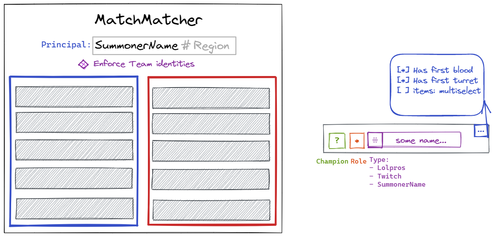
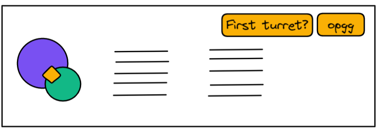
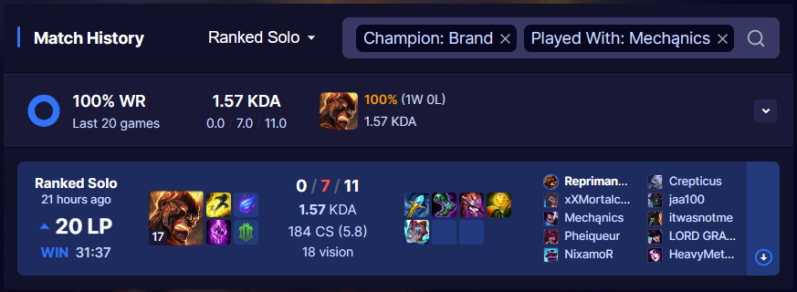
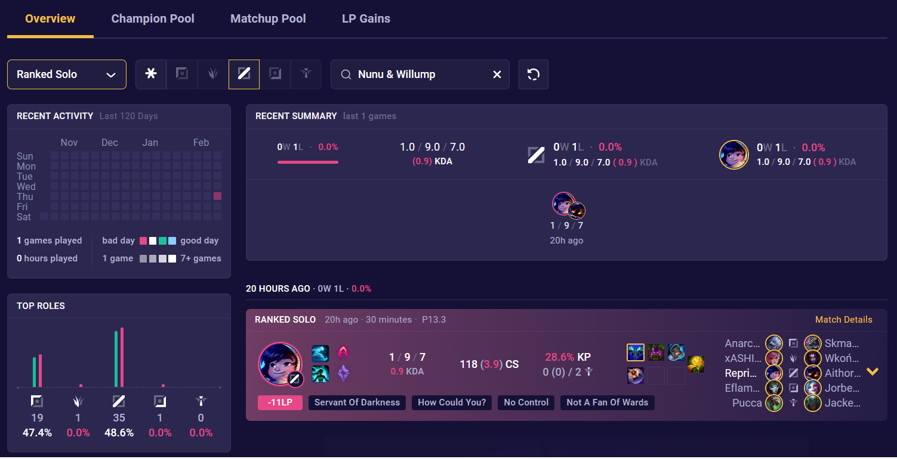
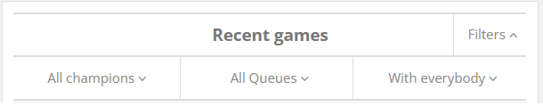
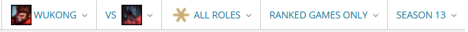

# UI Design
MM is a domain-specific **query builder**. It uses the MERN stack.

## Wireframes

Input:



How it should work:
- Select item from the pool
- If the same item is was selected in another Select, show it in gray
- Selecting the gray item shows
    if user confirms, you deselects it from the original item

Output:



## UI libraries

- Uber/BaseWeb looks a11y and cool

Interesting projects:
- `react-select`
- `radix-ui` https://www.radix-ui.com
- https://edisondesignsystem.com
- Centralized data store: https://github.com/pmndrs/zustand

Insp:
- @vkaelin__LeagueStats

## Existing solutions

- U.GG
UI similar to Discord's.
```
// played as {champion} AND played with {summoner}
    [
        {summonerName: me, champion},
        {summonerName: summoner}
    ]
```


- Mobalytics
```
// played {role} AND played as {champion}
    [
        {
            summonerName: me,
            teamPosition: role,
            champion: champion,
        }
    ]
```


- LeagueOfGraphs
```
// Variant 1: played as {champion} with {summoner}
    [
        {summonerName: me, champion},
        {summonerName: other.summonerName, teamId: {$eq: principalTeamId}}
    ]

// Variant 2: played as {my.champion} vs {their.champion} in {role}
    [
        {summonerName: my.summonerName, champion: my.champion, role},
        {champion: their.champion, role, teamId: {$ne: principalTeamId}},
    ]
```



---

END.
